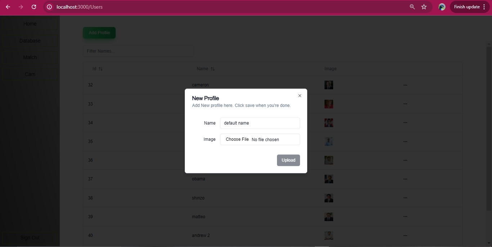

# face-forensic

This application front end is based on nextjs and frontend is based on FASTAPI. Neon SQL database is used for storage. this application use opensource face analysis modules/weights. app key features are:

FACE DETECTION:
Detects multiple faces in a picture.
Provides face embeddings, face pose, and key face positions.
Adjustable detection threshold

RECOGNITION:
Recognizes faces using stored data in the database.
Provides recognition scores.
LIVE CAM:
Supports camera stream for real-time face detection and recognition.
 
## 🎉 block diagram

    

 

## 🎉 Face Detection Model
* RetinaFace is a practical single-stage face detector which is accepted by CVPR 2020. We provide training code, training dataset, pretrained models and evaluation scripts. [RetinaFace (CVPR'2020)](https://github.com/deepinsight/insightface/blob/master/detection/retinaface).

## 🎉 Face Recognition Model
* commonly used network backbones are included in most of the methods, such as IResNet, MobilefaceNet, MobileNet, InceptionResNet_v2, DenseNet, etc... [ArcFace_mxnet (CVPR'2019)](https://github.com/deepinsight/insightface/blob/master/recognition/arcface_mxnet).

## 🎉 Pretrained Models
*Please check [Model-Zoo](https://github.com/deepinsight/insightface/wiki/Model-Zoo) for more pretrained models.

## 🎉Demo

    

    

    

    

    

    

    

